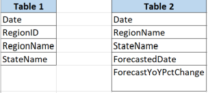

## Housing Data 

## Overview of the Analysis

### Backgroung

https://www.zillow.com/research/data/

Our machine model will learn to tell us using 5 factors when the housing market will boom or bust. Inputs: Home value forecast, Zillow Observed Rent Index (ZORI), Median Sale Price:, Median List Price, Price Cuts
Which factor is weighed how much? equally
How many layers? 1 layer
Predicts busts and booms
Most of these start going down, bust
They go up, a boom in the market
Supervised learning because we have labels
Classification
Booming or busting

# References

We made an important Google Drive folder with everything in it:

https://drive.google.com/drive/folders/1jt_SYqlQy0iqgjkiEEsU6wbk-BqBQ79b

 I used Excel and Word to make a make-up as a Triangle. 

## Selected topic

## Make deep learning model to predict busts and booms ##

1.Selected topic:

US Housing Market(data provided by Zillow) 

Link: https://www.zillow.com/research/data/

## Description of their source of data

The data sets that will be used for this project are provided by Zillow. All data sets are relating to the US Housing market prices, indexes, trends, etc. 

Questions they hope to answer with the data 

- To seek out trends in the US housing market.
- Predict whether there will be a boom or crash in the US housing market in the next couple of years given the data sets provided on Zillow. 
- Identify states that are the least and most expensive for the typical income brackets of different home owners. - Are new listings more expensive than other listings? 

2. Reason why they selected their topic 
The US housing market is relatively interesting and there were low interest rates during the covid period. Did that led to an increase in purchase of homes?
 9929dbd793fa8b235970cb123db25a5a939173f2

## Database 

The data sets provided by Zillow include Home Values, Home Values Forecasts, Rentals, Inventory, List and Sale Prices, Sales Count and Price Cuts for the United States.

-Home Values Data Set: Zillow Home Value Index (ZHVI) provides the measures of the home value and market changes by region and housing type.
-Home Values Forecasts: Zillow Home Value Forecast (ZHVF) one year forecast that is created by using data from all the homes. 
-Rentals: Zillow Observed Rent Index (ZORI) provides the typical rate rent by region. 
-Inventory: For-sale inventory, new listings, newly pending listings, days to pending. This is reported on a weekly cadence but the data set is only updated monthly. 
-List and Sale Prices: data set provides the median list price and the median sale price. This is reported on a weekly cadence but the data set is only updated monthly. 
-Sales Count and Price Cuts:

Our team will be using SQL to join the data sets and create two tables. The first table will include the RegionID, RegionName, StateName, Date, and dollar value. We will be able to join this table by using RegionID. The second table will include the RegionName, StateName, ForecastedDate, ForecastYoYPctChange. We will be able to join by RegionName. Example: 

Link to Zillow csv data sets: https://www.zillow.com/research/data/

