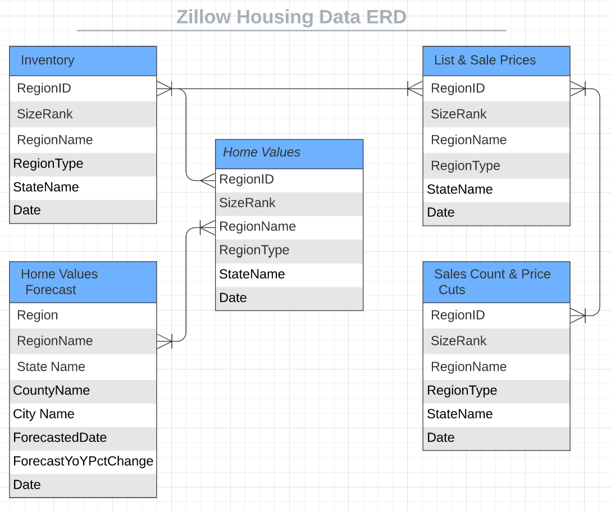

# Housing_Data

## Selected topic

=======

## Make deep learning model to predict busts and booms ##
=======
1.Selected topic:

US Housing Market(data provided by Zillow) 

Link: https://www.zillow.com/research/data/

## Description of their source of data

The data sets that will be used for this project are provided by Zillow. All data sets are relating to the US Housing market prices, indexes, trends, etc. 
=======
2. Reason why they selected their topic 
The US housing market is relatively interesting and there were low interest rates during the covid period. Did that led to an increase in purchase of homes?

## Database 
Team members present a provisional database that stands in for the final database and accomplishes the following:
1. Sample data that mimics the expected final database structure or schema
The data sets provided by Zillow include House Values, Home Values Forecasts, Rentals, Inventory, List and Sale Prices, Sales Count and Price Cuts. The ERD below helps visualize how we will be able to connect the data sets available. The RegionID column will be the primary key. By analyzing the ERD, you can  tell that the Rentals data set would not provide any valuable insights for our project so it was removed. 

 

Data filters: State, Year
1. Draft machine learning module is connected to the provisional database
